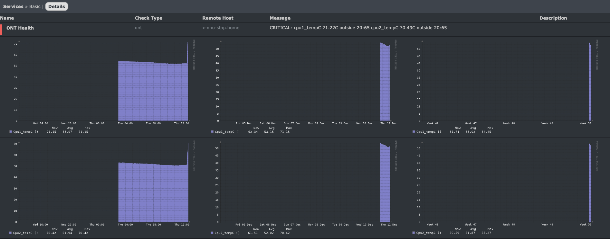
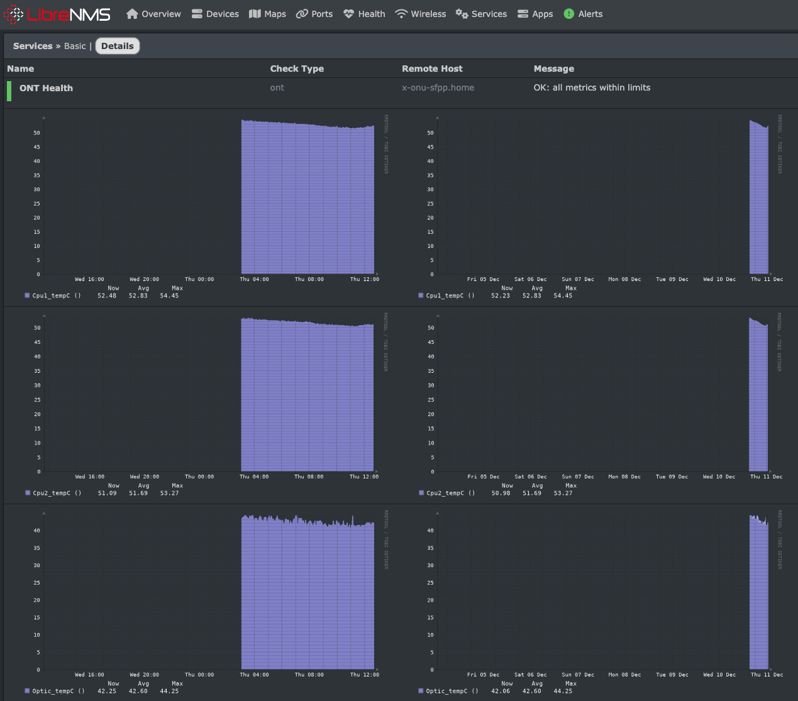
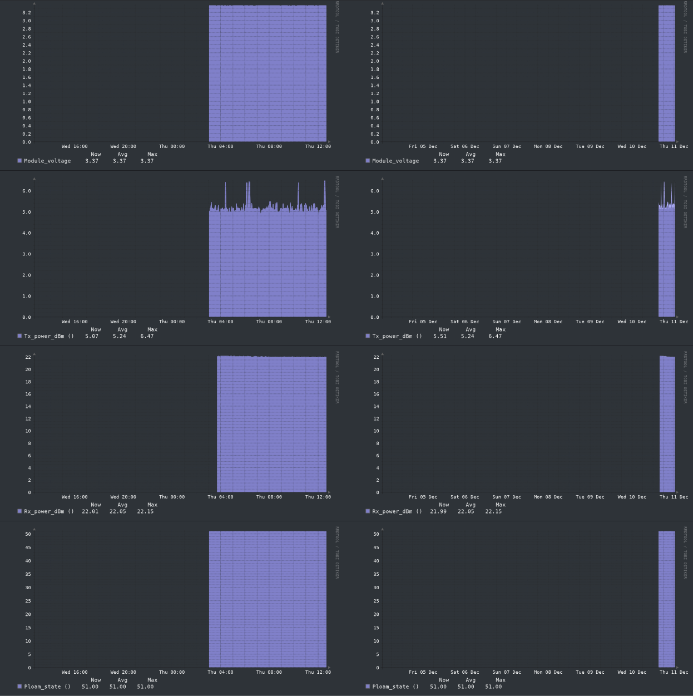

# check_ont Nagios Plugin
check_ont is a [Nagios Plugin](https://nagios-plugins.org/), compatible with a wide variety of network monitoring software.

check_ont will read the 8311 firmware's metrics page, and create metrics for each emitted variable. I have defined sensible defaults for the metrics 
based on [pon.wiki](https://pon.wiki)'s documentation.

# Installation
The script uses Bash and Python (to avoid jq requirement), which were both available on my [LibreNMS](https://librenms.org) installation.

I run LibreNMS in Docker, so I copied this into the `monitoring-plugins` folder available to me, and then restarted the stack, and I was able to see `check_ont` on the Services page.

Next, I added the `ont` check to my X-ONU-SFPP host.

Note: The default is to return only positive values, because LibreNMS does not graph negative numbers properly. If you'd like to use the real values, 
pass "-r".

# Example output

`OK: all metrics within limits | 'cpu1_tempC'=54.45;20:65;20:65;; 'cpu2_tempC'=53.07;20:65;20:65;; 'optic_tempC'=44.0;20:65;20:65;; 
'module_voltage'=3.37;3.201:3.399;3.201:3.399;; 'tx_power_dBm'=5.03;4:9;4:9;; 'rx_power_dBm'=22.15;8:29;8:29;; 'ploam_state'=51;51:51;51:51;;`

# Example output when alerting

`CRITICAL: cpu1_tempC 73.36C outside 20:65 cpu2_tempC 72.65C outside 20:65 | 'cpu1_tempC'=73.36;20:65;20:65;; 'cpu2_tempC'=72.65;20:65;20:65;; 
'optic_tempC'=64.5;20:65;20:65;; 'module_voltage'=3.36;3.201:3.399;3.201:3.399;; 'tx_power_dBm'=5.21;4:9;4:9;; 'rx_power_dBm'=22.37;8:29;8:29;; 
'ploam_state'=51;51:51;51:51;;`

# Example alert

# Example metrics

# Disclaimer

This README was totally human-written, and the script was totally vibe coded.
